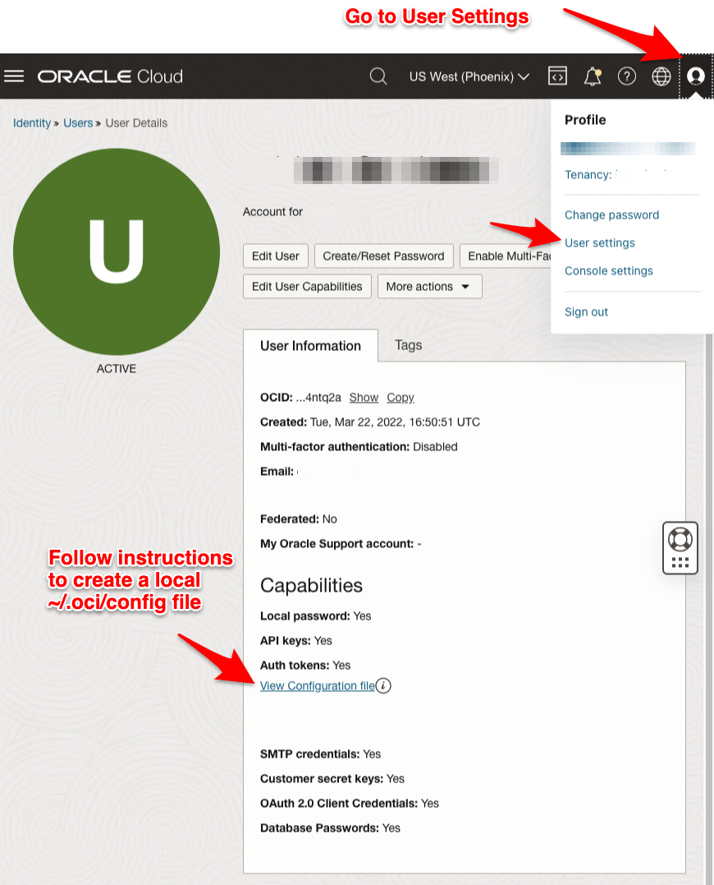

# OCI Log Downloader

This sample program lets you download logs from OCI Logging Service and Audit Service to a local file.

## Run in OCI Cloud Shell

The SDK for Python is pre-configured with your credentials and ready to use
immediately from within [Cloud Shell](https://docs.oracle.com/en-us/iaas/Content/API/Concepts/cloudshellquickstart_python.htm). 
Files produced by this sample within Cloud Shell can be subsequently downloaded to your local machine.

## Run Locally

This sample acquires its credentials from the same configuration file that the CLI uses.
If you don't want to install the CLI and have OCI Console access, you can create the config file
manually.

## Install

Set up your Python virtual environment and install the requirements from with the project directory:

    python3 -m venv venv
    source venv/bin/activate
    $venv pip install -r requirements.txt

## Usage

Here are some examples of how to invoke the program.

### Specific Time Frame

Download the entries from a given Log that were written in between specific start and end times.
To target a specific Log, you need to pass in the compartment, log and log group OCIDs.

    $venv python3 main.py \
    compartment_ocid=ocid1.compartment.oc1... \
    log_ocid=ocid1.log.oc1... \
    log_group_ocid=ocid1.loggroup.oc1... \
    output_file=./oci_log_specific_time_frame.json \
    start_time_iso_format=2023-07-11T00:26:27 \
    end_time_iso_format=2023-07-11T00:27:27

_ISO format supported: "%Y-%m-%dT%H:%M:%S"_

### Relative Time Frame

Download the last 5 minutes of entries from a given log.

    $venv python3 main.py \
    compartment_ocid=ocid1.compartment.oc1... \
    log_ocid=ocid1.log.oc1... \
    log_group_ocid=ocid1.loggroup.oc1... \
    output_file=./oci_log_relative_time_frame.json \
    start_time_minutes_ago=5 \
    end_time_minutes_ago=0

### All Logs in Log Group

Download the last 5 minutes of entries from a given log group.  Note the
absence of a log OCID.

    $venv python3 main.py \
    compartment_ocid=ocid1.compartment.oc1... \
    log_group_ocid=ocid1.loggroup.oc1... \
    output_file=./oci_logs_from_log_group.json \
    start_time_minutes_ago=5 \
    end_time_minutes_ago=0

### All Logs in Compartment

Downloads the last 60 minutes of entries from *all logs within a given Compartment* including _Audit logs.
Note the absence of log and log group OCIDs.

    $venv python3 main.py \
    compartment_ocid=ocid1.compartment.oc1... \
    output_file=./oci_logs_from_compartment.json \
    start_time_minutes_ago=60 \
    end_time_minutes_ago=0

### Filtering

Download the log content stanza contains a given string.  The program passes this as a wildcard so
it will return partial matches.

    $venv python3 main.py \
    compartment_ocid=ocid1.compartment.oc1... \
    log_ocid=ocid1.log.oc1... \
    log_group_ocid=ocid1.loggroup.oc1... \
    output_file=./oci_log_rejects.json \
    start_time_iso_format=2023-07-11T00:26:27 \
    end_time_iso_format=2023-07-11T00:27:27 \
    where_log_content_contains="REJECT"

    $venv python3 main.py \
    compartment_ocid=ocid1.compartment.oc1... \
    log_ocid=ocid1.log.oc1... \
    log_group_ocid=ocid1.loggroup.oc1... \
    output_file=./oci_log_rejects.json \
    start_time_iso_format=2023-07-11T00:26:27 \
    end_time_iso_format=2023-07-11T00:27:27 \
    where_log_content_contains="10.0.0.218"